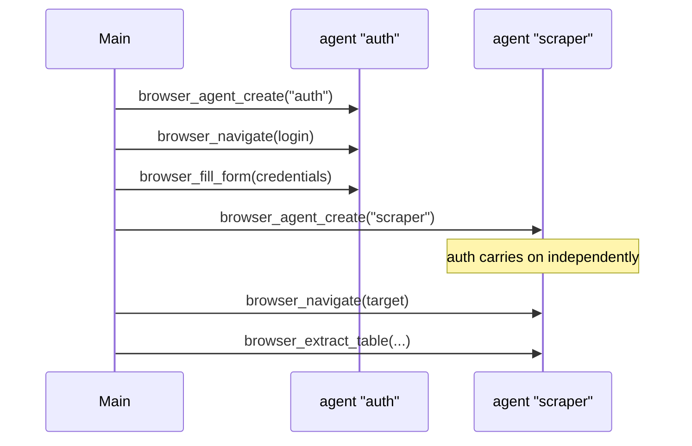

# Browser Agent

The skill is the entry point. The power is in `mcp__browser-agent__*` tools — **76 tools** covering the full Playwright API over CDP. Always call MCP tools directly; this skill maps task types to exact calls.

## Companion MCPs

This browser agent works best paired with other MCPs for full power:

| MCP | Use With Browser Agent For |
|-----|---------------------------|
| **research-assistant** | Deep research, multi-source analysis, academic search, fact-checking, content summarization. Browser agent handles navigation/interaction; research-assistant handles analysis/extraction. |
| **search-cluster** | Aggregated search across Google CSE, GNews, Wikipedia, Reddit when DuckDuckGo isn't enough. |

**Workflow**: Use `browser_search(query)` for quick lookups. For deep research, chain browser navigation with `research-assistant` tools for sentiment analysis, keyword extraction, citation formatting, and multi-query analysis.

## Dispatch Table

| Task | Primary Call | Fallback |
|------|-------------|---------|
| Navigate to URL | `browser_navigate(url)` | `browser_navigate(url, retries=2)` |
| Search the web | `browser_search(query)` | `browser_navigate('https://duckduckgo.com/?q=...')` |
| Sense page state (structure only) | `browser_get_state()` | `browser_observe()` |
| Sense page state (with visual) | `browser_get_state(screenshot=true)` | `browser_screenshot()` |
| Enumerate interactable elements only | `browser_observe()` | `browser_get_state()` |
| Click by element ref | `browser_click_ref(ref)` | `browser_click(selector)` |
| Diff AX tree snapshots | `browser_state_diff()` | — |
| Extract Tables | `browser_extract_table(selector)` | `browser_get_text()` |
| Semantic Click | `browser_click_text(text, type='button')` | `browser_click(selector)` |
| Fill whole form (simple) | `browser_fill_form(data={...})` | `browser_type()` |
| Fill whole form (type-aware) | `browser_fill_form(data={...}, typeAware=true)` | per-field `browser_type` |
| Manage Tabs | `browser_new_tab()`, `browser_list_tabs()`, `browser_switch_tab(index)` | — |
| Wait (networkidle) | `browser_wait_until_stable()` | `browser_wait(3000)` |
| Wait (load event) | `browser_wait_for_load(state='load')` | `browser_wait_for_load(state='domcontentloaded')` |
| Wait (URL/selector after action) | `browser_wait_for_navigation(urlPattern/selector)` | `browser_wait(1500)` |
| Save session (cookies only) | `browser_save_session(name)` | — |
| Save session (full auth state) | `browser_save_session(name, includeStorage=true)` | — |
| Load session | `browser_load_session(name)` | — |
| List saved sessions | `browser_list_sessions()` | — |
| Export current state (JSON) | `browser_export_state()` | `browser_export_state(outputPath, includeAxTree=true)` |
| Create named agent/page | `browser_agent_create(name)` | — |
| Switch to named agent | `browser_agent_switch(name)` | — |
| Remove named agent | `browser_agent_remove(name)` | — |
| List all agents | `browser_agent_list()` | — |
| Agent Profile | `browser_set_agent_profile(profile='stealth')` | — |
| Handle CAPTCHA | `browser_handle_captcha()` | auto-switches to DuckDuckGo on Google CAPTCHA |
| Click element | `browser_click(selector)` | `browser_click(x, y)` — includes smart retry fallbacks |
| Type text | `browser_type(selector, text, delay=120)` | — |
| Select dropdown | `browser_select(selector, value)` | `browser_evaluate(script)` |
| Select radio/checkbox by index | `browser_select_by_index(selector, index)` | `browser_click_ref(ref)` |
| Check/uncheck | `browser_check(selector)` / `browser_uncheck(selector)` | — |
| Hover then click | `browser_hover(selector)` → wait → `browser_click(selector)` | — |
| Scroll to element | `browser_scroll_to(selector)` | `browser_scroll(direction, amount)` |
| Lazy-load content | `browser_smart_scroll(steps=5)` | — |
| Extract text | `browser_get_text(selector, all=true, maxLines=200)` | `browser_get_html(selector)` |
| Extract visible text only | `browser_get_visible_text(selector)` | `browser_get_text(selector)` |
| Save page as PDF | `browser_print_to_pdf(outputPath)` | `browser_print_to_pdf()` (auto-named) |
| Run JS in page | `browser_evaluate(script)` | `browser_evaluate(script, args={...})` |
| Block requests | `browser_intercept(pattern, action='block')` | — |
| Mock API response | `browser_intercept(pattern, action='mock', body={...})` | — |
| Inject req headers | `browser_intercept(pattern, action='modify', headers={...})` | — |
| Capture API responses | `browser_intercept_api(pattern, action='start')` | `browser_get_captured_apis()` |
| List intercepts | `browser_intercept_list()` | — |
| Clear intercepts | `browser_clear_intercepts()` | — |
| Dismiss modal | `browser_dismiss_popups()` | `browser_evaluate("el.remove()")` |
| Console logs / JS errors (source-mapped) | `browser_console_messages(type='error', maxLines=200)` | — |
| Network request log | `browser_network_requests(filter, statusMin=400, maxLines=200)` | — |
| Browser health check | `browser_health()` | — |
| Structured data extraction | `browser_extract_schema(schema)` | `browser_extract_table(selector)` |
| Core Web Vitals + timing | `browser_performance()` | — |
| Validate outcome (planner-validator) | `browser_assert(condition)` | — |
| Generate Playwright test from session | `browser_generate_playwright_test()` | — |
| Start fresh recording | `browser_clear_recording()` | — |
| Action cache stats | `browser_cache_stats()` | — |
| Get cookies | `browser_get_cookies()` | — |
| Press key | `browser_press(key)` | — |
| Drag element | `browser_drag(source, target)` | — |
| Navigate history | `browser_back()` / `browser_forward()` / `browser_reload()` | — |
| OCR text extraction | `browser_ocr(selector, preprocess='threshold')` | `browser_screenshot()` + manual reading |
| Record macro | `browser_record_macro(action='start')` | `browser_generate_playwright_test()` |
| Replay macro | `browser_replay_macro(macroName='...')` | `browser_replay_macro(actions=[...])` |
| Batch answer quiz | `browser_batch_answer_quiz(answers=[...])` | per-question `browser_select_by_index` + `browser_click` |
| Switch to new tab | `browser_switch_to_new_tab(urlPattern)` | `browser_list_tabs()` + `browser_switch_tab()` |
| Parallel page execution | `browser_parallel_execute(tasks=[...])` | sequential `browser_agent_switch` + actions |
| Assert element visible | `browser_assert_visible(selector)` | `browser_get_state()` + check elements |
| Assert element text | `browser_assert_text(selector, expected)` | `browser_get_text(selector)` + check content |
| Assert URL contains | `browser_assert_url(pattern)` | check `page.url()` manually |
| Read page as markdown | `browser_get_page_markdown(selector?)` | `browser_get_text(selector)` |
| Get accessibility tree | `browser_get_accessibility_tree(selector?)` | `browser_get_state()` |
| Mock network response | `browser_mock_network(pattern, body)` | `browser_intercept(pattern, action='mock')` |
| Clear all mocks | `browser_clear_mocks()` | `browser_clear_intercepts()` |
| Handle JS dialog | `browser_dialog(action='accept')` | manual `page.on('dialog')` |
| Upload file | `browser_upload(selector, filePath)` | `browser_fill_form(typeAware=true)` for file inputs |
| Click Nth match | `browser_click_nth(selector, index)` | `browser_click(selector)` with specific selector |
| Highlight element | `browser_highlight(selector, color?)` | `browser_screenshot()` without highlight |
| Wait for content change | `browser_wait_for_change(selector)` | `browser_wait(ms)` + poll |

## Wait Strategy Guide

| Situation | Tool |
|-----------|------|
| Standard page load | `browser_wait_for_load()` |
| SPA / AJAX-heavy page | `browser_wait_until_stable()` |
| Page has WebSocket / long-polling | `browser_wait_for_load()` — networkidle will hang |
| Waiting for a specific element | `browser_wait_for_selector(selector)` |
| Waiting for URL change | `browser_wait_for_url(pattern)` |
| After click that navigates | `browser_wait_for_navigation(urlPattern)` or `browser_wait_for_navigation(selector)` |

## browser_evaluate Notes

- Use `return` to return a value: `return document.title`
- Supports `await`: `const r = await fetch('/api'); return r.status`
- Pass data via `args`: `return args.multiplier * 2` with `args={"multiplier": 5}`
- Errors are surfaced as `isError: true` with the JS exception message

## Session Recovery

The browser-agent persists its state (open pages, URLs, intercept rules) to `user_data/session_state.json` on every navigation and intercept change. If the browser process crashes or is killed:

1. The next tool call triggers `getBrowserContext()`, which detects the dead context
2. A new browser instance is launched automatically
3. Previous tabs are reopened at their last URLs
4. All intercept rules are re-applied
5. The active page is restored

State is cleared on explicit `browser_close()`.

## Browser Stability

The browser layer is hardened for long-running, fault-tolerant operation. No action is required from the agent — these are automatic.

- **Launch retry with backoff** — `chromium.launchPersistentContext` is wrapped in exponential backoff (env: `BROWSER_LAUNCH_RETRIES`, `BROWSER_LAUNCH_BACKOFF`). Cold starts recover from transient failures.
- **Tab creation retry** — if a `Target.createTarget` or protocol error occurs when opening a new tab, the context is reset and the call is retried up to 3 times.
- **Context health probe** — the cached context is checked for liveness (5s timeout) before reuse. Dead contexts are torn down and relaunched transparently.
- **Dedicated Chromium** — set `CHROMIUM_EXECUTABLE_PATH=/path/to/chromium` (or `CHROMIUM_CHANNEL=chrome`) to use a specific binary instead of Playwright's bundled one.
- **Headless toggle** — set `BROWSER_HEADLESS=true` for CI / production.
- **`browser_health` tool** — returns `contextAlive`, `pageResponsive`, `pageCount`, `pageLatencyMs`, `activePageUrl`, `headless`, `executablePath`, `launchRetries`. Call this when something feels off (zombie context, unresponsive page, repeated failures).

## Form Fill Strategy

For most forms, the simple call works:
```
browser_fill_form(data={"#email": "me@example.com", "#password": "secret"})
```

For structured forms with mixed input types (date pickers, numbers, emails, tel, urls, selects, checkboxes, radios, file inputs, contenteditable), enable type-aware mode — it auto-detects each input's type and uses the right Playwright method with value coercion:
```
browser_fill_form(
  data={
    "#email":   "me@example.com",
    "#dob":     "1990-01-15",
    "#qty":     "3",
    "#phone":   "+1 555 123 4567",
    "#site":    "example.com",        // auto-prefixed with https://
    "#agree":   "yes",                // truthy → checked
    "#avatar":  "/path/to/img.png",   // single file
    "#docs":    "/a.pdf, /b.pdf",     // comma-separated → multiple files
    "#bio":     "Long markdown..."    // contenteditable → keyboard.type
  },
  typeAware=true
)
```

Type-aware is more reliable for real-world forms and validates emails before filling.

## Named Agents (Parallelism)

Each `browser_agent_create(name)` gives you an independent page within the same browser context. Use this when:

- Sub-agents or parallel tasks need their own page without stepping on each other
- You want to keep a page on hold while working with another
- Multi-account or multi-page workflows



## Page State Diffing

Each `browser_get_state()` call automatically saves an AX tree snapshot. The previous snapshot is preserved as `laststate.json`:

1. **Call 1** → `currentstate.json` saved
2. **Call 2** → `currentstate.json` → `laststate.json`, new `currentstate.json` saved
3. **`browser_state_diff()`** → compares both, returns:
   - URL/title changes
   - New/removed headings
   - Interactive element count changes (by tag type)
   - Popup appeared/dismissed
   - CAPTCHA status transitions

Pure JSON comparison — zero image processing, minimal tokens.

## Sense Strategy (Hybrid)

Screenshots consume significant tokens. Use them only when the AX tree is not enough.

| Situation | Tool | Screenshot? |
|-----------|------|-------------|
| Plan next action — what can I click? | `browser_observe()` | ❌ |
| First look at unfamiliar page | `browser_get_state()` | ❌ |
| Page has canvas, iframes, shadow DOM, or custom widgets | `browser_get_state(screenshot=true)` | ✔️ |
| Explicit visual verification (layout, images, CAPTCHA) | `browser_screenshot()` or `browser_get_state(screenshot=true)` | ✔️ |
| After action, check what changed | `browser_state_diff()` | ❌ |
| Debug JS errors after interaction | `browser_console_messages(type='error')` | ❌ |
| Verify API call was made | `browser_network_requests(filter='/api/')` | ❌ |

**When AX tree is incomplete** (elements not appearing in `browser_observe` / `browser_get_state`):
- Canvas-rendered UIs (charts, games, custom drawings)
- `aria-hidden="true"` elements that are visually important
- Cross-origin iframes
- Web components with closed shadow DOM

In those cases, call `browser_get_state(screenshot=true)` or `browser_screenshot()` to see what the page actually looks like.

`browser_observe` returns only interactable elements with `ref` numbers — no headings, no text blocks, no AX tree, no image. Use `browser_click_ref(ref)` to act on them.

## Planner-Validator Loop

After any action that has a verifiable outcome, use `browser_assert` before continuing:

```
browser_click_text("Submit")
→ browser_assert(condition="[role='alert']", expected="Success")
  ✓ passed → continue
  ✗ failed → re-plan based on what's actually on the page
```

## Schema Extraction

For structured data (product info, prices, article metadata):

```
browser_extract_schema({
  schema: {
    properties: {
      title:  { type: "string",  description: "page title or product name" },
      price:  { type: "number",  description: "price in dollars" },
      rating: { type: "string",  description: "rating score" }
    }
  }
})
```

Returns typed JSON directly — more reliable than scraping raw text.

## Test Generation

Record a workflow then export as a replayable Playwright test:

```
browser_clear_recording()        # start fresh
... interact with site ...
browser_generate_playwright_test(testName="checkout_flow", outputPath="/tmp/test.spec.js")
```

## Core Rules

1. **Sense before act** — call `browser_get_state()` before an unfamiliar page. Add `screenshot=true` only when elements may be hidden from AX tree (canvas, iframes, shadow DOM).
2. **Default no-screenshot** — `browser_observe()` and `browser_get_state()` (no arg) cost no image tokens. Reserve `screenshot=true` / `browser_screenshot()` for when visual context is genuinely needed.
3. **Cap diagnostics output** — when calling `browser_console_messages`, `browser_network_requests`, or `browser_get_text(all=true)` on busy pages, pass `maxLines` (e.g. 200) to control token cost.
4. **Never zero-delay type** — minimum `delay=50`, target `delay=120` for public sites.
5. **Selector priority**: `#id` → `[data-testid]` → `[role]`/text → ref number → `.class` → `x,y` coordinates. Smart retry auto-fallbacks on failure.
6. **After navigation** — call `browser_wait_for_navigation()` or `browser_wait_for_selector` before next interaction.
7. **On blocked elements** — call `browser_dismiss_popups()` first, then coordinate fallback, then `browser_evaluate`.
8. **Sites with WebSocket/SSE** — use `browser_wait_for_load()` not `browser_wait_until_stable()` or you will hang.
9. **On persistent failures** — call `browser_health()`. If `contextAlive=false` or `pageResponsive=false`, the next tool call will auto-recover; otherwise investigate the active URL and recent `browser_console_messages(type='error')`.
10. **Structured forms** — prefer `browser_fill_form(..., typeAware=true)` over per-field `browser_type` when the form has mixed input types (date/number/email/tel/url/select/checkbox/radio/file/contenteditable).
11. **Quiz automation** — use `browser_batch_answer_quiz()` for entire exams. Use `browser_select_by_index()` for individual questions. Avoid text-based selection for quiz options.
12. **API-first extraction** — when available, use `browser_intercept_api()` to capture structured data directly instead of DOM scraping.
13. **Assert after actions** — use `browser_assert_visible`, `browser_assert_text`, or `browser_assert_url` after actions with verifiable outcomes. Assertions never throw — they return PASS/FAIL.
14. **Read content as markdown** — prefer `browser_get_page_markdown()` over `browser_get_text()` for comprehension tasks. It returns structured headings, lists, and tables.
15. **Mock for testing** — use `browser_mock_network()` to isolate frontend from backend. Always `browser_clear_mocks()` when done.
16. **Dialog before trigger** — call `browser_dialog()` BEFORE the action that opens the dialog. Handler persists for one dialog only.
17. **Click nth for lists** — use `browser_click_nth(selector, index)` when `browser_click()` throws "strict mode violation" due to multiple matches.
18. **Wait for change** — use `browser_wait_for_change(selector)` after SPA actions that update content in-place, instead of arbitrary `browser_wait()`.

## API Capture Workflow

For quiz platforms or any site loading data via XHR/fetch:

```
1. browser_intercept_api(pattern="**/api/**", action="start", reloadPage=true)
2. browser_get_captured_apis()           → extract questions as JSON
3. browser_batch_answer_quiz(answers=[...], submitAfter=true)
```

No screenshots needed — pure structured data extraction.

## OCR Workflow

For code-based questions or visual text:

```
1. browser_ocr(selector=".code-block", preprocess="threshold")
   → returns extracted code text
2. Analyze the code
3. browser_select_by_index(selector="input[name=q5]", index=2)
```

## Macro Recording

Record once, replay with different parameters:

```
1. browser_record_macro(action="start")
   ... answer questions manually ...
2. browser_record_macro(action="stop", save=true, name="quiz-flow")
3. browser_replay_macro(macroName="quiz-flow")
```

## Deep References

Load these only when needed:

- **[patterns.md](references/patterns.md)** — search, form, extraction, and troubleshooting flows.
- **[selectors.md](references/selectors.md)** — AX tree usage, dynamic content, coordinate fallbacks.
- **[stealth.md](references/stealth.md)** — anti-detection, human-like timing, behavioral red flags.

## Assertion Workflow

Assertions verify outcomes without breaking flow. They return `[PASS]` or `[FAIL]` — never throw.

```
browser_click_text("Submit")
→ browser_assert_visible("[role='alert']")
  ✓ [PASS] → continue
  ✗ [FAIL] → re-plan based on what's actually on the page
```

### Types:
- `browser_assert_visible(selector)` — element exists and is visible
- `browser_assert_text(selector, expected)` — element contains substring
- `browser_assert_url(pattern)` — URL contains pattern

### Use after every action with a verifiable outcome:
```
browser_fill_form({"#email": "test@example.com"}, submit=true)
→ browser_assert_url("/dashboard")
→ browser_assert_text(".welcome", "Hello")
```

## Perception Tools

Read page content as structured data instead of raw DOM.

| Tool | Returns | Best For |
|------|---------|----------|
| `browser_get_page_markdown(selector?)` | Markdown with headings, lists, tables, links | Reading article content, product info |
| `browser_get_accessibility_tree(selector?)` | YAML-like roles/names/states | Understanding component structure |

### When to use:
- Reading page content for comprehension → `browser_get_page_markdown()`
- Understanding what elements are available → `browser_get_accessibility_tree()`
- Scoping to a section → pass CSS selector

### Example:
```js
browser_get_page_markdown("article.post")
// Returns:
// # Title of Article
// ## Section 1
// - List item 1
// - List item 2
// [Read more](https://...)
```

## Network Mocking

Mock API responses for frontend testing without touching the backend.

```
// Mock a specific API endpoint
browser_mock_network("**/api/users*", { users: [{id: 1, name: "Test"}] })

// Frontend now receives mocked data
browser_navigate("http://localhost:3000/users")
→ page shows mocked users list

// Restore normal behavior
browser_clear_mocks()
```

### Use cases:
- Test error handling: mock 500 responses
- Test empty states: mock empty arrays
- Test loading states: add delays to mocked responses
- Isolate frontend from backend during testing

## Dialog Handling

Set up handlers for `alert()`, `confirm()`, and `prompt()` dialogs.

```
// MUST call before the action that triggers the dialog
browser_dialog(action="accept", promptText="Hello")
browser_click("#show-alert")
// dialog is auto-accepted

browser_dialog(action="dismiss")
browser_click("#confirm-delete")
// dialog is auto-dismissed (clicks Cancel)
```

### Important:
- Call `browser_dialog` BEFORE the action that triggers it
- Handler persists for one dialog, then resets
- For `prompt()`, provide `promptText` parameter

## File Upload

Upload files to `<input type="file">` elements.

```
browser_upload("#avatar", "/path/to/photo.jpg")
browser_upload("#documents", "/file1.pdf, /file2.pdf")  // multiple files
```

### Notes:
- Path must be absolute
- Comma-separated for multiple files
- Input must have `type="file"` attribute

## Click Nth Match

Click the Nth element when multiple elements match a selector.

```
browser_click_nth(".product-card", 0)   // first product
browser_click_nth(".product-card", 2)   // third product
browser_click_nth("button", -1)         // last button
```

### Use when:
- `browser_click(selector)` throws "strict mode violation"
- You need a specific item from a list
- Elements don't have unique IDs

## Visual Debugging

Highlight elements before screenshots to verify location.

```
browser_highlight("#submit-btn", color="red", durationMs=3000)
browser_screenshot()  // screenshot shows highlighted element
```

### Use for:
- Verifying selector matches the right element
- Debugging layout issues
- Documenting element locations

## Wait for Change

Wait for SPA content to update after an action.

```
browser_click("#calculate")
browser_wait_for_change("#results", timeout=5000)
browser_get_text("#results")  // now contains updated data
```

### When to use:
- After clicking buttons that update content
- After form submissions that update a section
- When content loads asynchronously (not full page navigation)
