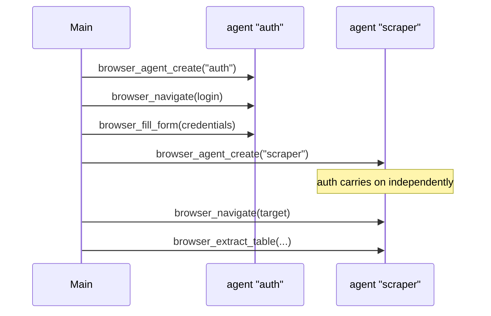

# Browser Agent

The skill is the entry point. The power is in `mcp__browser-agent__*` tools — **61 tools** covering the full Playwright API over CDP. Always call MCP tools directly; this skill maps task types to exact calls.

## Dispatch Table

| Task | Primary Call | Fallback |
|------|-------------|---------|
| Navigate to URL | `browser_navigate(url)` | `browser_navigate(url, retries=2)` |
| Sense page state (structure only) | `browser_get_state()` | `browser_observe()` |
| Sense page state (with visual) | `browser_get_state(screenshot=true)` | `browser_screenshot()` |
| Enumerate interactable elements only | `browser_observe()` | `browser_get_state()` |
| Click by element ref | `browser_click_ref(ref)` | `browser_click(selector)` |
| Diff AX tree snapshots | `browser_state_diff()` | — |
| Extract Tables | `browser_extract_table(selector)` | `browser_get_text()` |
| Semantic Click | `browser_click_text(text, type='button')` | `browser_click(selector)` |
| Fill whole form | `browser_fill_form(data={...})` | `browser_type()` |
| Manage Tabs | `browser_new_tab()`, `browser_list_tabs()`, `browser_switch_tab(index)` | — |
| Wait (networkidle) | `browser_wait_until_stable()` | `browser_wait(3000)` |
| Wait (load event) | `browser_wait_for_load(state='load')` | `browser_wait_for_load(state='domcontentloaded')` |
| Extract Tables | `browser_extract_table(selector)` | `browser_get_text()` |
| Save session (cookies only) | `browser_save_session(name)` | — |
| Save session (full auth state) | `browser_save_session(name, includeStorage=true)` | — |
| Load session | `browser_load_session(name)` | — |
| Create named agent/page | `browser_agent_create(name)` | — |
| Switch to named agent | `browser_agent_switch(name)` | — |
| Remove named agent | `browser_agent_remove(name)` | — |
| List all agents | `browser_agent_list()` | — |
| Agent Profile | `browser_set_agent_profile(profile='stealth')` | — |
| Handle CAPTCHA | `browser_handle_captcha(wait=true)` | — |
| Click element | `browser_click(selector)` | `browser_click(x, y)` |
| Type text | `browser_type(selector, text, delay=120)` | — |
| Select dropdown | `browser_select(selector, value)` | `browser_evaluate(script)` |
| Check/uncheck | `browser_check(selector)` / `browser_uncheck(selector)` | — |
| Hover then click | `browser_hover(selector)` → wait → `browser_click(selector)` | — |
| Scroll to element | `browser_scroll_to(selector)` | `browser_scroll(direction, amount)` |
| Lazy-load content | `browser_smart_scroll(steps=5)` | — |
| Extract text | `browser_get_text(selector)` | `browser_get_html(selector)` |
| Save page as PDF | `browser_print_to_pdf(outputPath)` | `browser_print_to_pdf()` (auto-named) |
| Run JS in page | `browser_evaluate(script)` | `browser_evaluate(script, args={...})` |
| Block requests | `browser_intercept(pattern, action='block')` | — |
| Mock API response | `browser_intercept(pattern, action='mock', body={...})` | — |
| Inject req headers | `browser_intercept(pattern, action='modify', headers={...})` | — |
| List intercepts | `browser_intercept_list()` | — |
| Clear intercepts | `browser_clear_intercepts()` | — |
| Dismiss modal | `browser_dismiss_popups()` | `browser_evaluate("el.remove()")` |
| Console logs / JS errors (source-mapped) | `browser_console_messages()` | — |
| Network request log | `browser_network_requests(filter)` | — |
| Structured data extraction | `browser_extract_schema(schema)` | `browser_extract_table(selector)` |
| Core Web Vitals + timing | `browser_performance()` | — |
| Validate outcome (planner-validator) | `browser_assert(condition)` | — |
| Generate Playwright test from session | `browser_generate_playwright_test()` | — |
| Start fresh recording | `browser_clear_recording()` | — |
| Action cache stats | `browser_cache_stats()` | — |
| Get cookies | `browser_get_cookies()` | — |
| Press key | `browser_press(key)` | — |
| Drag element | `browser_drag(source, target)` | — |
| Navigate history | `browser_back()` / `browser_forward()` / `browser_reload()` | — |

## Wait Strategy Guide

| Situation | Tool |
|-----------|------|
| Standard page load | `browser_wait_for_load()` |
| SPA / AJAX-heavy page | `browser_wait_until_stable()` |
| Page has WebSocket / long-polling | `browser_wait_for_load()` — networkidle will hang |
| Waiting for a specific element | `browser_wait_for_selector(selector)` |
| Waiting for URL change | `browser_wait_for_url(pattern)` |

## browser_evaluate Notes

- Use `return` to return a value: `return document.title`
- Supports `await`: `const r = await fetch('/api'); return r.status`
- Pass data via `args`: `return args.multiplier * 2` with `args={"multiplier": 5}`
- Errors are surfaced as `isError: true` with the JS exception message

## Session Recovery

The browser-agent persists its state (open pages, URLs, intercept rules) to `user_data/session_state.json` on every navigation and intercept change. If the browser process crashes or is killed:

1. The next tool call triggers `getBrowserContext()`, which detects the dead context
2. A new browser instance is launched automatically
3. Previous tabs are reopened at their last URLs
4. All intercept rules are re-applied
5. The active page is restored

State is cleared on explicit `browser_close()`.

## Named Agents (Parallelism)

Each `browser_agent_create(name)` gives you an independent page within the same browser context. Use this when:

- Sub-agents or parallel tasks need their own page without stepping on each other
- You want to keep a page on hold while working with another
- Multi-account or multi-page workflows



## Page State Diffing

Each `browser_get_state()` call automatically saves an AX tree snapshot. The previous snapshot is preserved as `laststate.json`:

1. **Call 1** → `currentstate.json` saved
2. **Call 2** → `currentstate.json` → `laststate.json`, new `currentstate.json` saved
3. **`browser_state_diff()`** → compares both, returns:
   - URL/title changes
   - New/removed headings
   - Interactive element count changes (by tag type)
   - Popup appeared/dismissed
   - CAPTCHA status transitions

Pure JSON comparison — zero image processing, minimal tokens.

## Sense Strategy (Hybrid)

Screenshots consume significant tokens. Use them only when the AX tree is not enough.

| Situation | Tool | Screenshot? |
|-----------|------|-------------|
| Plan next action — what can I click? | `browser_observe()` | ❌ |
| First look at unfamiliar page | `browser_get_state()` | ❌ |
| Page has canvas, iframes, shadow DOM, or custom widgets | `browser_get_state(screenshot=true)` | ✔️ |
| Explicit visual verification (layout, images, CAPTCHA) | `browser_screenshot()` or `browser_get_state(screenshot=true)` | ✔️ |
| After action, check what changed | `browser_state_diff()` | ❌ |
| Debug JS errors after interaction | `browser_console_messages(type='error')` | ❌ |
| Verify API call was made | `browser_network_requests(filter='/api/')` | ❌ |

**When AX tree is incomplete** (elements not appearing in `browser_observe` / `browser_get_state`):
- Canvas-rendered UIs (charts, games, custom drawings)
- `aria-hidden="true"` elements that are visually important
- Cross-origin iframes
- Web components with closed shadow DOM

In those cases, call `browser_get_state(screenshot=true)` or `browser_screenshot()` to see what the page actually looks like.

`browser_observe` returns only interactable elements with `ref` numbers — no headings, no text blocks, no AX tree, no image. Use `browser_click_ref(ref)` to act on them.

## Planner-Validator Loop

After any action that has a verifiable outcome, use `browser_assert` before continuing:

```
browser_click_text("Submit")
→ browser_assert(condition="[role='alert']", expected="Success")
  ✓ passed → continue
  ✗ failed → re-plan based on what's actually on the page
```

## Schema Extraction

For structured data (product info, prices, article metadata):

```
browser_extract_schema({
  schema: {
    properties: {
      title:  { type: "string",  description: "page title or product name" },
      price:  { type: "number",  description: "price in dollars" },
      rating: { type: "string",  description: "rating score" }
    }
  }
})
```

Returns typed JSON directly — more reliable than scraping raw text.

## Test Generation

Record a workflow then export as a replayable Playwright test:

```
browser_clear_recording()        # start fresh
... interact with site ...
browser_generate_playwright_test(testName="checkout_flow", outputPath="/tmp/test.spec.js")
```

## Core Rules

1. **Sense before act** — call `browser_get_state()` before an unfamiliar page. Add `screenshot=true` only when elements may be hidden from AX tree (canvas, iframes, shadow DOM).
2. **Default no-screenshot** — `browser_observe()` and `browser_get_state()` (no arg) cost no image tokens. Reserve `screenshot=true` / `browser_screenshot()` for when visual context is genuinely needed.
3. **Never zero-delay type** — minimum `delay=50`, target `delay=120` for public sites.
4. **Selector priority**: `#id` → `[data-testid]` → `[role]`/text → ref number → `.class` → `x,y` coordinates.
5. **After navigation** — call `browser_wait_for_selector` before next interaction.
6. **On blocked elements** — call `browser_dismiss_popups()` first, then coordinate fallback, then `browser_evaluate`.
7. **Sites with WebSocket/SSE** — use `browser_wait_for_load()` not `browser_wait_until_stable()` or you will hang.

## Deep References

Load these only when needed:

- **[patterns.md](references/patterns.md)** — search, form, extraction, and troubleshooting flows.
- **[selectors.md](references/selectors.md)** — AX tree usage, dynamic content, coordinate fallbacks.
- **[stealth.md](references/stealth.md)** — anti-detection, human-like timing, behavioral red flags.
